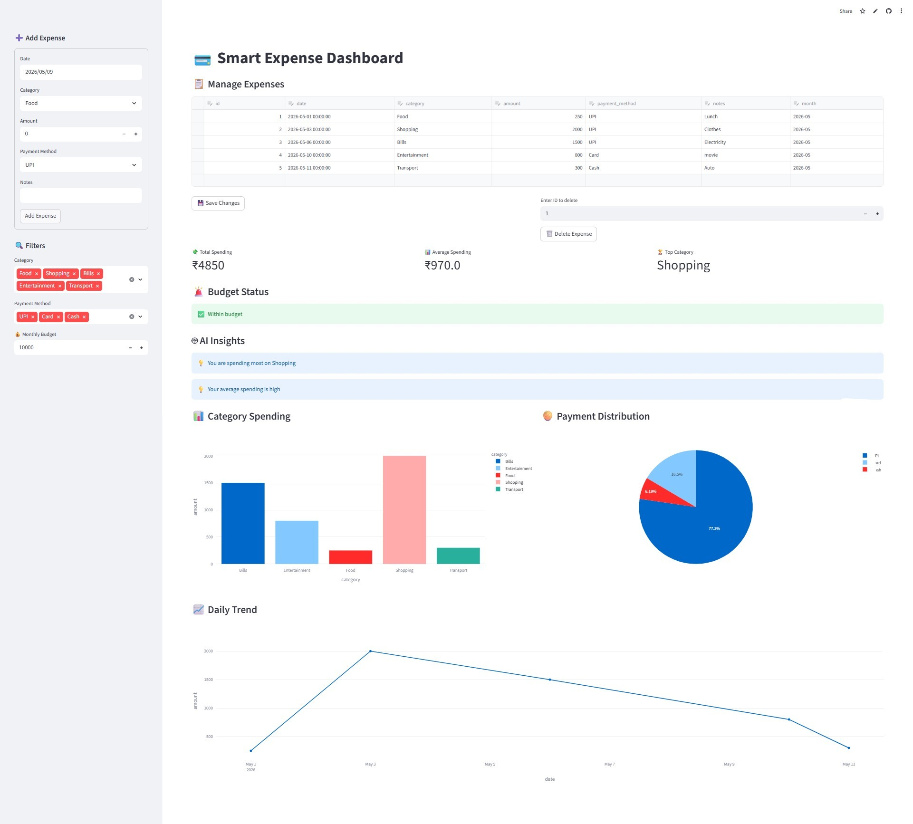
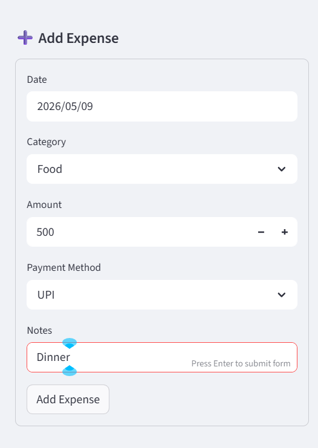
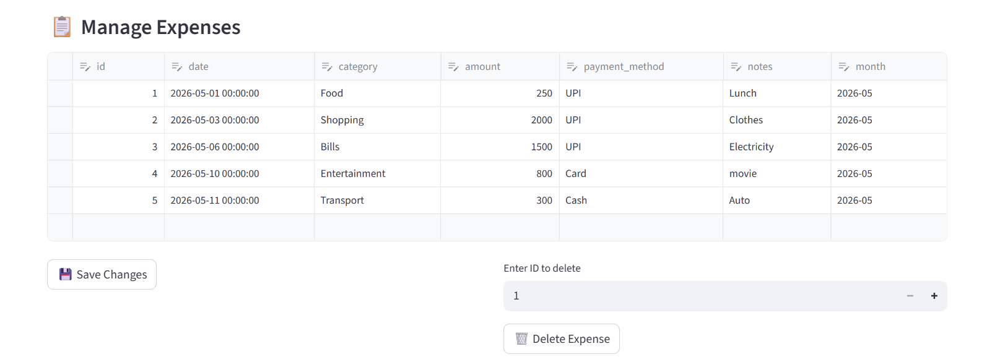

# 💳 Smart Expense Tracker with Data Visualization

## 📌 Project Overview
A Python-based Personal Expense Tracker built using Streamlit and SQLite that helps users track expenses, analyze spending patterns, and visualize financial data in real-time.

This project simulates a real-world fintech dashboard with data entry, analytics, insights, and budget monitoring.

---

## 🚀 Features
- ➕ Add daily expenses
- ✏️ Edit expense data
- 🗑️ Delete expenses
- 📊 Category-wise spending analysis
- 📈 Daily spending trends
- 🥧 Payment method distribution
- 🚨 Budget alert system
- 🤖 AI-like spending insights
- 💾 SQLite database integration
- 📱 Interactive Streamlit dashboard

---

## 🛠️ Tech Stack
- Python 🐍
- Streamlit
- Pandas
- Plotly
- SQLite

---

## 📂 Project Structure

```bash
smart-expense-dashboard/
│
├── app.py
├── expenses.db
├── requirements.txt
├── README.md
└── screenshots/
    ├── dashboard_overview.png
    ├── add_expense_form.png
    ├── manage_expenses.png
    ├── ai_budget_insights.png
    ├── live_app.png

```

---

## ▶️ How to Run Locally

```bash
pip install -r requirements.txt
streamlit run app.py

```


## 📊 Sample Insights
- Highest spending category: Shopping
- Budget alerts when overspending
- AI insight: “You spend more on Shopping than other categories”
- Daily & monthly trend visualization

---
## 📸 Screenshots

### Dashboard


## Add Expense Form 


## Manage Expenses 


## AI Insights


---
## 🎯 Learning Outcomes
- Learned CRUD operations using SQLite
- Built interactive dashboards using Streamlit
- Performed data analysis using Pandas
- Created financial insights using Python logic
- Understood real-world fintech app structure

---
## 🔗 Live Demo
```
https://your-app.streamlit.app

```
⁠
---
## 👨‍💻 Author
Nidhi Apotikar
